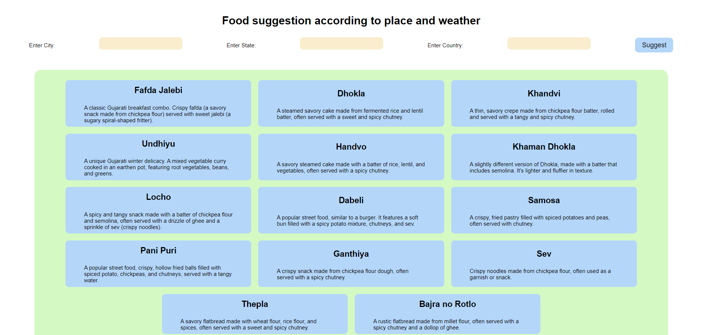

## Weather-Wise Eats: Dining Delights Based on Weather and Location ☁️✨

Weather-Wise Eats is a user-friendly Flask web application that empowers you to discover delectable meals that complement the current weather in your location and take into account your specific region. It seamlessly integrates with OpenWeatherMap's API to fetch real-time weather data (temperature, weather type) and leverages a custom food suggestion module (or a different approach, as applicable) to recommend suitable dishes.

**Features:**

* **Weather-Based and Location-Aware Recommendations:** Uncover mouthwatering meal ideas that align with the current weather in your locale, ensuring your culinary choices are both delightful and suitable for the climate.
* **OpenWeatherMap Integration:** Accurate weather data retrieval for precise suggestions.
* **Custom Food Suggestion Module (or Alternative Approach):** Logic tailored to recommend the perfect dishes based on weather conditions and potentially your region's unique culinary offerings.

**Technologies:**

* Flask
* OpenWeatherMap API (API Key Required)
* Gemini API

**Setup:**

1. Create a virtual environment and install Flask:

   ```bash
   python -m venv venv
   source venv/bin/activate (or venv\Scripts\activate on Windows)
   pip install Flask
   ```

3. Replace `'API_KEY'` in `app.py` with your OpenWeatherMap API key.

4. Run the application:

   ```bash
   python app.py
   ```

**How it Works:**

This app fights decision fatigue! It uses Flask to ask your food preferences and restrictions. Based on your answers, it recommends meals using smarty-pants algorithms (think matching preferences or ingredients). It can even connect to recipe databases for details (optional). Imagine - no more "what's for dinner?" woes!
